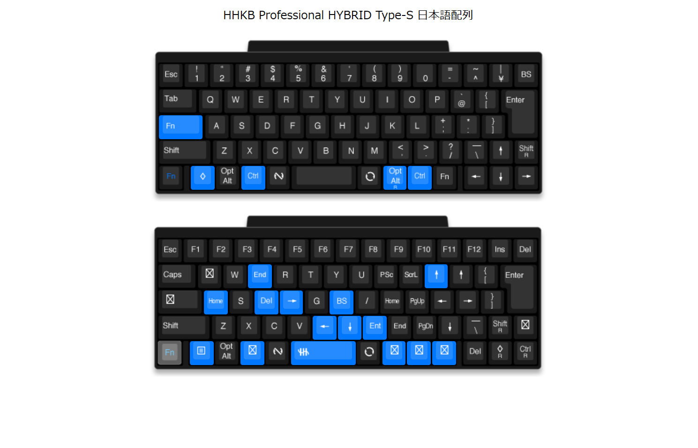
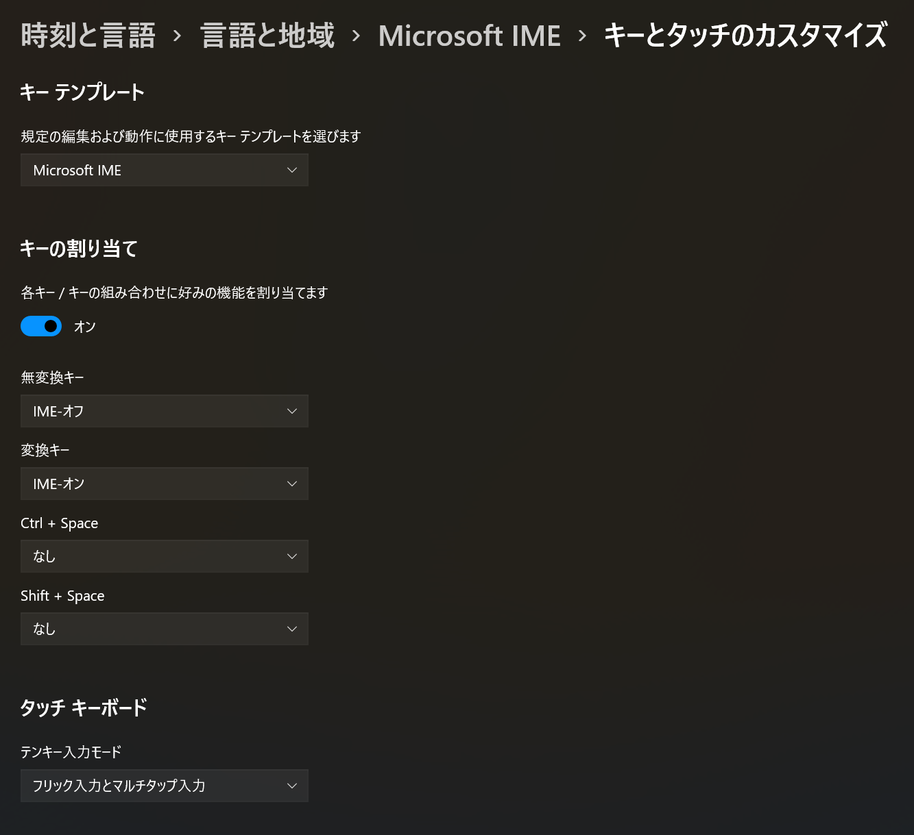

# hhkb-setting
AutoHotKeyみたいな設定を入れられないときに**JIS配列HHKB**だけでWindowsをMacっぽく操作するための設定

## こだわりポイント
- Fnキーとセットでemacsキーバインドっぽいカーソルの操作
- Aキーの左(本来はCtrl)をFnキーに設定
- Ctrlキーは親指で押すのでMacモードのCmdキーの位置に設定

## IMEの切り替えはWindows側で設定(Windows10以降)
IMEの設定で変換/無変換にIMEのオン/オフを割り当てるとMacのかな/英数のように日本語・英語の入力を切り替えられるようになる

